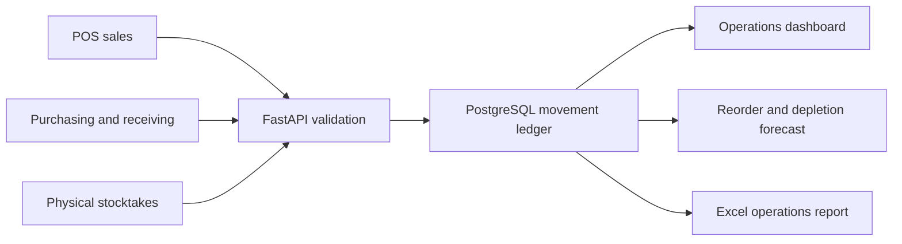

# Cafe ERP Portfolio Case Study

## Context

The cafe counted and ordered stock in package units: milk bottles or cartons, coffee bags and individual eggs. Recipes, however, consume fractions of those packages. Cafe ERP preserves both views without forcing managers to count litres or kilograms.

## Delivered system

- PostgreSQL Product Master, purchasing, receiving, recipe, POS and stocktake model
- Immutable signed inventory ledger with source traceability
- FastAPI operational and write endpoints
- Responsive Next.js dashboard, reorder, POS usage, forecast and report views
- Formula-driven Excel operations workbook
- Deterministic clean and error scenarios for repeatable demonstration
- GitHub Actions verification and Vercel Services deployment configuration

## Architecture

## Core decisions

| Decision | Reason |
|---|---|
| Keep inventory in bottle, carton, bag or each | Matches real stock counts and ordering language |
| Store package content separately | Supports recipe conversion without changing the manager-facing unit |
| Never edit or delete posted movements | Preserves a reconstructable audit trail |
| Correct differences with signed adjustments | Makes stocktake and input corrections explicit |
| Model receiving around shortages and missing items | Reflects the cafe's observed delivery problems |
| Use an explainable baseline forecast | Keeps a synthetic-data prototype honest and auditable |

## Verification

The committed CI workflow provisions PostgreSQL 16, applies the schema, loads the deterministic error scenario, runs all SQL flow checks and 26 Python tests, then lints and builds the Next.js application. Vercel Services local verification confirms the UI and FastAPI service operate behind one routed origin.
